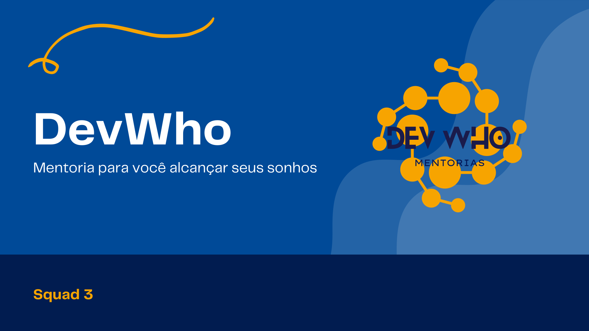

    

<h1 align="center">DevWho | Mentorias</h1>

# 🖥️📙 **Sobre o projeto**
A ***Dev Who*** é uma empresa de mentorias voltada para profissionais que queiram se aperfeiçoar na área de desenvolvimento web ou que estejam em processo de migração de carreira, recebendo uma mentoria personalizada, voltada para seus objetivos e dificuldades específicas.

Site desenvolvido para a finalização do módulo II, do curso de Desenvolvimento FullStack no **Resilia Educação**.

# Tabela de conteúdos
<!--ts-->
   * [Status do projeto](#status-projeto)
   * [Objetivo](#tabela-de-conteudo)
   * [Funcionalidades](#funcionalidades)
   * [Tecnologias utilizadas](#tecnologias)
   * [Construído com](#construido-com)
   * [Desenvolvido por](#desenvolvido)
<!--te-->

## 👷‍♀️ Status do projeto
---
<h3 align='center'> 
	 🚀Finalizado
</h3> 

## 🎯 Objetivo
---

Colocar em prática os conhecimentos do módulo II de desenvolvimento frontend, colocando em prática todos as funcionalidades aprendidas até o momento, com o desenvolvimento, em grupo, de um site completo.

## ⚙️ Funcionalidades
---
- [x] Cadastro de usuário
- [x] Busca de endereço a partir do site
- [x] Página de recuperação de senha
- [x] Validação de entradas(senha/e-mail/CEP)

##  🛠️ Tecnologias utilizadas
---
### **Website**

 
    
    
    

 

##  🛠️ Contruído com
---
* [Visual Studio Code](https://code.visualstudio.com/)
* [API Via CEP](https://viacep.com.br/)
* [Bootstrap](https://getbootstrap.com/docs/5.0/getting-started/introduction/)
* [Jquery](https://jquery.com/)
* [Hoppscotch](https://hoppscotch.io/pt-br/)

##  🤓 Desenvolvido por
---
<table align='center'>
  <tr>
    <td align="center"><a href="https://github.com/lelaranja"> <b>Letícia Laranja</b></a> <a href="https://github.com/lelaranja" title="Letícia">🍊</a></td>
    <td align="center"><a href="https://github.com/alonso-estevam"> <b>Alonso Estevam</b></a> <a href="https://github.com/alonso-estevam" title="Alonso">🚀</a></td>
    <td align="center"><a href="https://github.com/BarbaraGuimaraes21"> <b>Bárbara Guimarães</b></a> <a href="https://github.com/BarbaraGuimaraes21" title="Bárbara">🚀</a></td>
     <td align="center"><a href="https://github.com/danbaziewicz"> <b>Danylo Baziewicz</b></a> <a href="https://github.com/danbaziewicz" title="Danylo">🚀</a></td>
    <td align="center"><a href="https://github.com/Edson-7728"> <b>Edson Vieira</b></a> <a href="https://github.com/Edson-7728" title="Edson">🚀</a></td>
  </tr>
